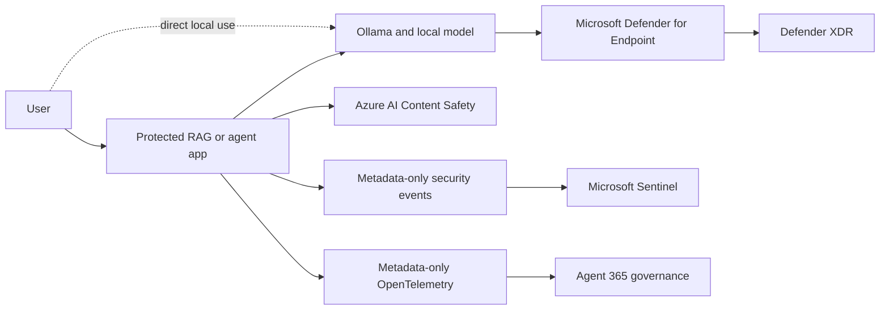

# Local AI Security

Reference architecture and reproducible validation tests for discovering and
governing local AI workloads built with Ollama, local models, protected RAG,
Microsoft Defender, Azure AI Content Safety, Microsoft Sentinel, and Agent 365.

Microsoft Purview complements this architecture through audit and governance;
although label-aware retrieval was outside the validated lab scope, a production
RAG design can enforce source permissions and Purview sensitivity-label protections
before authorized documents enter the model context.

The repository addresses three practical security questions:

1. How can an organization identify unsanctioned local AI runtimes and model
   activity?
2. Where can prompt, retrieval, tool, and response controls be enforced without
   exporting sensitive interaction content?
3. How should runtime vulnerabilities and unsafe model behavior be assessed when
   product inventory or CVE mapping is incomplete?

## Repository contents

| Path | Purpose |
|---|---|
| [`LOCAL-AI-SECURITY-ARCHITECTURE.md`](LOCAL-AI-SECURITY-ARCHITECTURE.md) | Detailed architecture, trust boundaries, evidence flows, limitations, and validated design decisions |
| [`customer-package/`](customer-package/) | Sanitized customer-facing runbooks, PowerShell scripts, KQL, synthetic test data, and the .NET agent sample |
| [`customer-package/SECURITY.md`](customer-package/SECURITY.md) | Package privacy, authentication, telemetry, and distribution requirements |

## Validation tests

| Test | Security objective | Entry point |
|---|---|---|
| 1 | Discover Ollama and named local-model activity with Microsoft Defender for Endpoint | [`test-1-discovery`](customer-package/test-1-discovery/) |
| 2.1 | Protect a local RAG flow with prompt-injection and output-safety controls, with optional metadata-only Sentinel events | [`test-2.1-protected-rag`](customer-package/test-2.1-protected-rag/) |
| 2.2 | Run a Microsoft Agent Framework application over local Ollama with inline safety and optional Agent 365 telemetry | [`test-2.2-agent`](customer-package/test-2.2-agent/) |
| 3.1 | Correlate local binary evidence, Defender TVM coverage, public advisories, and CISA KEV data | [`test-3.1-runtime-vulnerability`](customer-package/test-3.1-runtime-vulnerability/) |

## Architecture at a glance



The design keeps full prompts, retrieved content, and model responses local by
default. Central services receive security decisions and operational metadata only,
unless an organization explicitly approves broader collection and retention.

## Get started

1. Review the [architecture](LOCAL-AI-SECURITY-ARCHITECTURE.md) and choose the
   tests that match the intended security outcome.
2. Review the [customer package prerequisites](customer-package/README.md) and
   supply configuration through the documented parameters or environment variables.
3. Run the package privacy check before use or redistribution:

   ```powershell
   .\customer-package\scripts\Test-PackageForSensitiveData.ps1
   ```

4. Follow the selected test runbook and retain generated evidence according to the
   organization's security, privacy, and records-management policies.

Test 2.2 requires the .NET 8 SDK. The PowerShell tests support Windows PowerShell
5.1 or PowerShell 7. Exact Azure, Microsoft Defender, Sentinel, and Agent 365
permissions are documented in the relevant runbook.

## Security boundaries

- Endpoint telemetry can establish runtime execution, process lineage, command-line
  activity, listeners, and file identity. It does not guarantee access to local
  prompt or response content.
- Application-level prompt insight applies only when requests pass through the
  protected RAG application, agent, or another instrumented control point. Direct
  CLI or API use can bypass those controls.
- A valid binary signature establishes publisher identity and integrity, not that
  the runtime is vulnerability-free or fully patched.
- Missing Defender TVM software or CVE rows indicate a mapping gap, not proof that
  no vulnerability exists.
- Cloud-based safety analysis and telemetry are unavailable to a fully air-gapped
  workload unless an approved local equivalent or delayed-export design is added.

## Responsible use

Run these tests only in environments where you are authorized to inspect endpoint,
identity, prompt, retrieval, and security telemetry. Do not commit credentials,
customer evidence, generated identity configuration, model responses, retrieved
content, access tokens, certificates, or compiled artifacts.

The customer package contains placeholders and synthetic test data. Replace them
with customer-approved values at runtime and review all generated evidence before
sharing it outside the test environment.